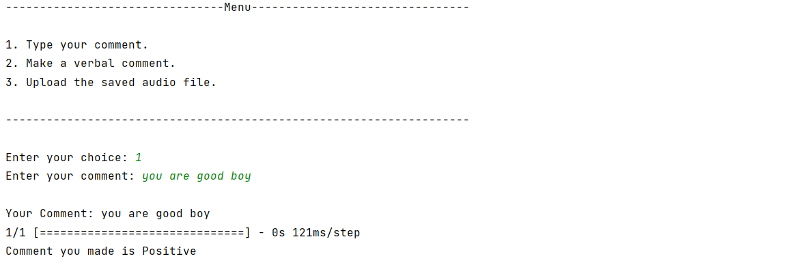
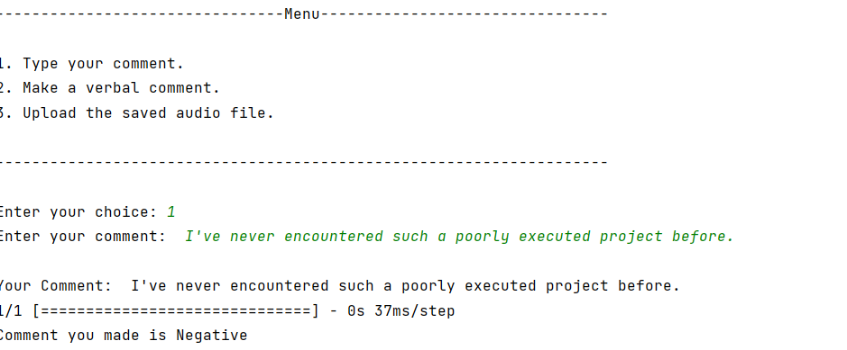

# Offensive Language Detection Project


## Table of Contents

- [Introduction](#introduction)
- [Requirements](#requirements)
- [How to run the project](#how-to-run-the-project)
- [Screenshots](#screenshots)


## Introduction

Offensive language detection is a crucial aspect of content moderation on online platforms. This project aims to classify comments into positive, negative, or neutral categories based on their content. The model is trained using a labeled dataset and employs natural language processing techniques.

## Requirements

- Python 3.x
- TensorFlow
- NLTK
- pandas
- numpy
- pyttsx3
- speech_recognition
- pydub
- word2number


Install the required Python packages using:

```
    pip install -r requirements.txt
````
                
## How to run the project
1. Train the model by running the following command.
```
python train_model.py
```
2. Run the project.
```
python main.py
```
3. To test, Enter any comment and check the result.

```commandline
----------------Menu-------------------
1] Type your comment.
2] Make a verbal comment.
3] Upload the saved audio file

```


4. To exit, enter one of the following codes
```
1. Exit
2. Stop
3. Escape
4. 0
5. Esc
```


## Screenshots
1] Screeshot 1



2] Screeshot 2
